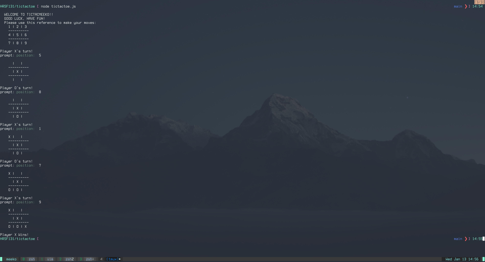

# TicTacToe - CLI
Two-player command line tic tac toe game

## Preview



## Usage

- Start a new game by running:
    ```
    node tictactoe.js
    ```
- The board is split up into 9 total sections each with a designated number
- Each player will select the desired section by typing the corresponding number + Enter
- Player 'X' will go first, then Player 'O', and so on...
- Game will end if the board is filled and neither player has a winning combination (draw) or if either player gets a winning combination (win)

## Requirements

- Node
-
- ### Installing Dependencies
-
- From within the root directory:
-
- ```sh
- npm install
- `````````
